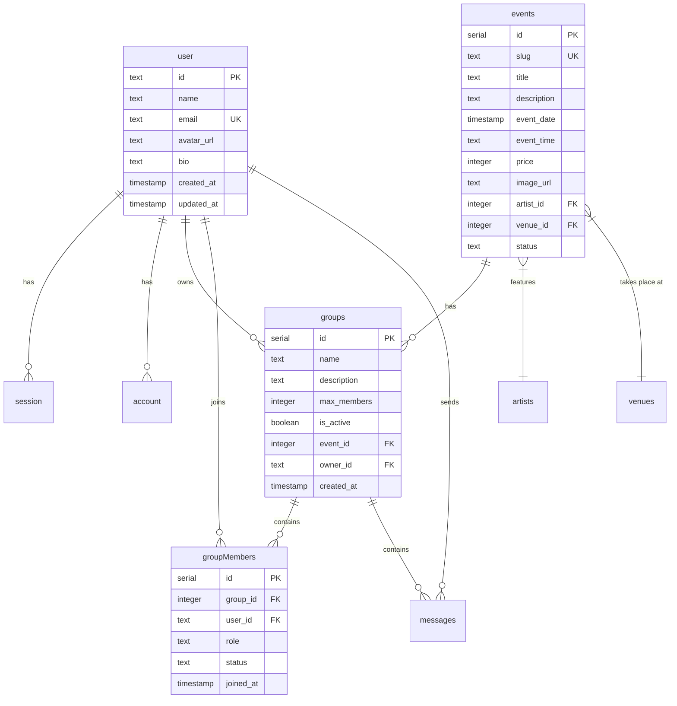

# Potes2Live - Architecture & Documentation Technique

## 📐 Architecture Globale

### Vue d'ensemble

**Potes2Live** est une application web permettant aux utilisateurs de trouver des concerts et de rejoindre/créer des groupes pour assister ensemble à ces événements.

### Stack technique

- **Frontend** : Next.js 16 (App Router), React 19, TailwindCSS 4
- **Backend** : Next.js Server Actions, API Routes
- **Base de données** : PostgreSQL (Neon)
- **ORM** : Drizzle ORM
- **Authentification** : Better-Auth (email/password)
- **Tests** : Vitest (unitaires), Playwright (E2E)
- **CI/CD** : GitHub Actions
- **Déploiement** : Vercel
- **Qualité** : ESLint, TypeScript strict

---

## 🏗️ Architecture Technique

### Architecture en couches

```
┌─────────────────────────────────────────────────────────┐
│                    CLIENT (Browser)                      │
│  ┌────────────┐  ┌────────────┐  ┌────────────┐        │
│  │   Pages    │  │ Components │  │   Hooks    │        │
│  │  (routes)  │  │   (UI)     │  │ (client)   │        │
│  └────────────┘  └────────────┘  └────────────┘        │
└──────────────────────────┬──────────────────────────────┘
                           │ fetch/actions
┌──────────────────────────▼──────────────────────────────┐
│                 SERVER (Next.js)                         │
│  ┌────────────┐  ┌────────────┐  ┌────────────┐        │
│  │   Actions  │  │  API Routes│  │    Auth    │        │
│  │ (business) │  │ (/api/auth)│  │(Better-Auth)        │
│  └─────┬──────┘  └────────────┘  └────────────┘        │
│        │                                                 │
│  ┌─────▼──────────────────────────────────────┐        │
│  │           Drizzle ORM (schema)             │        │
│  └─────────────────────┬──────────────────────┘        │
└────────────────────────┼────────────────────────────────┘
                         │ SQL
┌────────────────────────▼────────────────────────────────┐
│              PostgreSQL (Neon)                           │
│  ┌──────┐  ┌──────┐  ┌────────┐  ┌────────┐           │
│  │ user │  │events│  │ groups │  │messages│           │
│  └──────┘  └──────┘  └────────┘  └────────┘           │
└─────────────────────────────────────────────────────────┘
```

### Patterns de conception utilisés

#### 1. **Server Actions Pattern** (Next.js)
- Actions serveur côté backend (`"use server"`)
- Encapsulation de la logique métier
- Type-safety bout en bout
- Exemples : `concerts.action.ts`, `groups.actions.ts`, `auth.actions.ts`

#### 2. **Repository Pattern** (via Drizzle ORM)
- Abstraction de la couche d'accès aux données
- Requêtes typées et composables
- Relations définies dans `schema.ts`

#### 3. **Component Composition** (React)
- Composants réutilisables et modulaires
- Props typées avec TypeScript
- Séparation UI/logique (Server Components + Client Components)

#### 4. **Singleton** (Better-Auth client)
- Instance unique du client auth (`auth-client.ts`)
- Réutilisable dans toute l'app

---

## 📁 Structure du projet

```
my-app/
├── app/                          # Application Next.js (App Router)
│   ├── (auth)/                   # Routes d'authentification
│   │   ├── login/page.tsx
│   │   └── register/page.tsx
│   ├── actions/                  # 🔹 Server Actions (logique métier)
│   │   ├── auth.actions.ts       # Auth (session utilisateur)
│   │   ├── concerts.action.ts    # CRUD concerts
│   │   ├── groups.actions.ts     # CRUD groupes
│   │   ├── messages.actions.ts   # Chat groupes
│   │   └── user.ts               # Profil utilisateur
│   ├── api/                      # API Routes
│   │   └── auth/[...all]/        # Better-Auth endpoints
│   ├── components/               # Composants partagés
│   │   └── Navbar.tsx
│   ├── concerts/                 # Module Concerts
│   │   ├── page.tsx              # Liste concerts
│   │   ├── [slug]/page.tsx       # Détail concert
│   │   └── component/ConcertCard.tsx
│   ├── groups/                   # Module Groupes
│   │   ├── page.tsx              # Mes groupes
│   │   ├── [id]/page.tsx         # Chat groupe
│   │   └── components/
│   ├── lib/                      # 🔹 Bibliothèques & config
│   │   ├── auth.ts               # Config Better-Auth server
│   │   ├── auth-client.ts        # Client auth (hooks)
│   │   └── db/
│   │       ├── drizzle.ts        # Connexion DB
│   │       └── schema.ts         # 🔹 Modèle de données
│   ├── profile/                  # Profil utilisateur
│   ├── globals.css               # Styles globaux
│   ├── layout.tsx                # Layout racine
│   └── type.ts                   # 🔹 Types TypeScript globaux
├── tests/                        # 🔹 Tests unitaires
│   ├── setup.ts                  # Config Vitest
│   └── unit/
│       ├── navbar.test.tsx
│       ├── concert-card.test.tsx
│       ├── my-group-card.test.tsx
│       ├── concerts-actions.test.ts
│       └── action-helpers.test.ts
├── e2e/                          # 🔹 Tests End-to-End
│   ├── login.spec.ts             # Scénarios login/register
│   └── navigation.spec.ts        # Navigation & pages
├── scripts/                      # Scripts utilitaires
│   └── seed.ts                   # Seed BDD (concerts, artistes, venues)
├── drizzle/                      # Migrations SQL
├── .github/workflows/            # 🔹 CI/CD
│   └── ci.yml                    # GitHub Actions (lint, test, e2e)
├── vitest.config.ts              # Config tests unitaires
├── playwright.config.ts          # Config tests E2E
├── drizzle.config.ts             # Config Drizzle
├── TESTING.md                    # 🔹 Guide complet des tests
└── package.json
```

---

## 🗄️ Modèle de données

### Schéma relationnel



### Tables principales

#### **Authentification** (Better-Auth)
- `user` : utilisateurs
- `session` : sessions actives
- `account` : comptes (email/password)
- `verification` : tokens de vérification

#### **Métier**
- `events` : concerts/événements
- `artists` : artistes
- `venues` : salles de concert
- `groups` : groupes pour aller à un concert
- `groupMembers` : membres d'un groupe
- `messages` : chat des groupes

---

## 🔐 Sécurité

### Authentification
- **Better-Auth** : gestion email/password sécurisée
- Hashage bcrypt des mots de passe
- Sessions avec tokens expirables
- Protection CSRF via cookies HTTP-only

### Autorisations
- **Server Actions** : vérification session côté serveur
- Validation des permissions (créateur vs membre de groupe)
- Cascade delete (suppression utilisateur → sessions/comptes)

### Validation des données
- TypeScript strict pour le typage
- Validation côté serveur dans les actions
- Sanitisation des inputs
- Drizzle ORM protège contre les injections SQL

---

## 🧪 Stratégie de tests

### Tests unitaires (Vitest)
- **Composants React** : rendu, props, interactions
- **Actions serveur** : mocks des appels DB
- **Utilitaires** : helpers, formatage

**Coverage** :
- Navbar, ConcertCard, MyGroupCard
- Actions concerts (getUpcomingConcerts, getConcertsByCity)

### Tests E2E (Playwright)
- **Parcours utilisateur** : login, register, navigation
- **Validation formulaires** : champs requis, contraintes
- **Navigation** : navbar, liens, redirections

**Scénarios** :
- Pages login/register
- Navigation concerts/groups/profile
- Formulaires d'auth

### CI/CD (GitHub Actions)
1. Lint (ESLint)
2. Tests unitaires (Vitest)
3. Tests E2E (Playwright)
4. Déploiement automatique (Vercel)

---

## 🚀 Déploiement

### Environnements
- **Développement** : `npm run dev` → localhost:3000
- **Production** : Vercel → URL déployée

### Variables d'environnement
```env
DATABASE_URL=postgresql://...
BETTER_AUTH_SECRET=...
BETTER_AUTH_URL=https://...
NEXT_PUBLIC_BETTER_AUTH_URL=https://...
```

### Pipeline CI/CD
```
Push main → GitHub Actions → [Lint → Test → E2E] → Vercel Deploy
```

---

## 📊 Points forts de l'architecture

✅ **Modularité** : découpage fonctionnel (concerts, groups, auth)  
✅ **Type-safety** : TypeScript strict bout en bout  
✅ **Testabilité** : 17 tests (9 unitaires + 8 E2E)  
✅ **Scalabilité** : Server Actions + DB indexée  
✅ **Sécurité** : Better-Auth + validation serveur  
✅ **Maintenabilité** : patterns clairs, documentation  
✅ **Performance** : Server Components, caching Next.js  

---

## 📚 Documentation complémentaire

- [TESTING.md](TESTING.md) : guide complet des tests
- [README.md](README.md) : démarrage rapide
- Code source : annotations et types explicites
